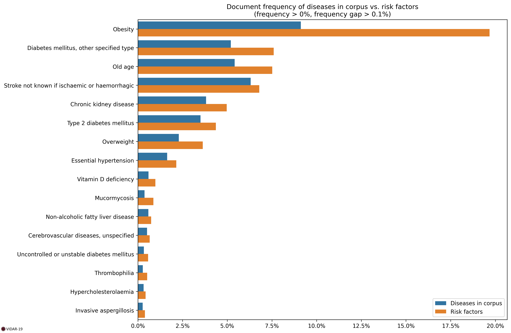

# COVID-19 Risk Factors

As of 2/06/2022, risk factors have been computed on 275K documents dealing with SARS-CoV-2 and COVID-19.

## Document Frequency

### Table

| Code   | Title                                         |   Diseases in corpus |   Risk factors |   Ratio |
|:-------|:----------------------------------------------|---------------------:|---------------:|--------:|
| 5B81   | Obesity                                       |                  9.1 |           19.7 |     2.2 |
| 5A13   | Diabetes mellitus, other specified type       |                  5.2 |            7.6 |     1.5 |
| MG2A   | Old age                                       |                  5.4 |            7.5 |     1.4 |
| 8B20   | Stroke not known if ischaemic or haemorrhagic |                  6.3 |            6.8 |     1.1 |
| GB61   | Chronic kidney disease                        |                  3.8 |            5   |     1.3 |
| 5A11   | Type 2 diabetes mellitus                      |                  3.5 |            4.4 |     1.2 |
| 5B80.0 | Overweight                                    |                  2.3 |            3.6 |     1.6 |
| BA00   | Essential hypertension                        |                  1.6 |            2.1 |     1.3 |
| 5B57   | Vitamin D deficiency                          |                  0.6 |            1   |     1.7 |
| 1F2C   | Mucormycosis                                  |                  0.4 |            0.9 |     2.3 |
| DB92   | Non-alcoholic fatty liver disease             |                  0.6 |            0.7 |     1.3 |
| 8B2Z   | Cerebrovascular diseases, unspecified         |                  0.5 |            0.7 |     1.3 |
| 5A24   | Uncontrolled or unstable diabetes mellitus    |                  0.3 |            0.6 |     1.7 |
| 3B61   | Thrombophilia                                 |                  0.3 |            0.5 |     1.9 |
| 5C80.0 | Hypercholesterolaemia                         |                  0.3 |            0.4 |     1.4 |
| 1F20.0 | Invasive aspergillosis                        |                  0.3 |            0.4 |     1.5 |
