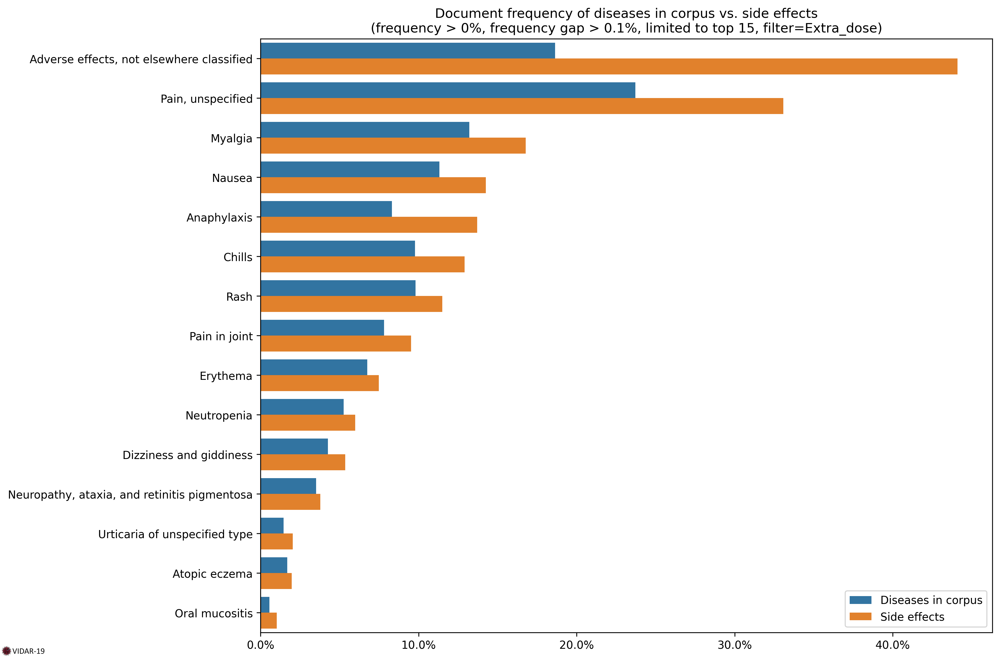

# Extra Dose Side Effects

As of 3/01/2022, extra dose side effects have been computed on 3K documents dealing with COVID-19 extra doses.

## Document Frequency

### Table

| Code    | Title                                        | Diseases in corpus | Side effects | Ratio |
| :------ | :------------------------------------------- | -----------------: | -----------: | ----: |
| NF09    | Adverse effects, not elsewhere classified    |               18.6 |         44.1 |   2.4 |
| MG3Z    | Pain, unspecified                            |               23.7 |         33.1 |   1.4 |
| FB56.2  | Myalgia                                      |               13.2 |         16.8 |   1.3 |
| MD90.0  | Nausea                                       |               11.3 |         14.3 |   1.3 |
| 4A84    | Anaphylaxis                                  |                8.3 |         13.7 |   1.6 |
| MG21    | Chills                                       |                9.8 |         12.9 |   1.3 |
| ME66.6  | Rash                                         |                9.8 |         11.5 |   1.2 |
| ME82    | Pain in joint                                |                7.8 |          9.5 |   1.2 |
| ME64.0  | Erythema                                     |                6.8 |          7.5 |   1.1 |
| 4B00.0  | Neutropenia                                  |                5.3 |            6 |   1.1 |
| MB48    | Dizziness and giddiness                      |                4.3 |          5.4 |   1.3 |
| 8C73.1  | Neuropathy, ataxia, and retinitis pigmentosa |                3.5 |          3.8 |   1.1 |
| EB05    | Urticaria of unspecified type                |                1.5 |            2 |   1.4 |
| EA80    | Atopic eczema                                |                1.7 |            2 |   1.2 |
| DA01.11 | Oral mucositis                               |                0.6 |            1 |   1.8 |
