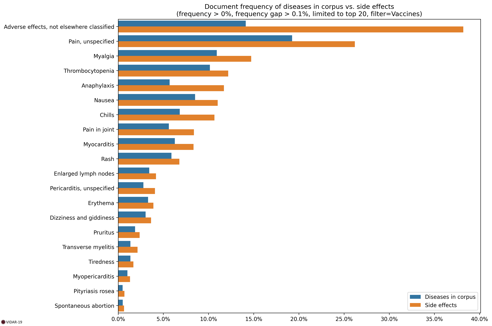

# Vaccines Side Effects

As of 2/06/2022, vaccines side effects have been computed on 21K documents dealing with COVID-19 vaccines.

## Document Frequency

### Table

| Code   | Title                                     | Diseases in corpus | Side effects | Ratio |
| :----- | :---------------------------------------- | -----------------: | -----------: | ----: |
| NF09   | Adverse effects, not elsewhere classified |               14.6 |         39.2 |   2.7 |
| MG3Z   | Pain, unspecified                         |               18.7 |         25.1 |   1.3 |
| FB56.2 | Myalgia                                   |               10.7 |         13.6 |   1.3 |
| 4A84   | Anaphylaxis                               |                5.8 |         11.6 |     2 |
| 3B64   | Thrombocytopenia                          |                9.9 |         11.5 |   1.2 |
| MD90.0 | Nausea                                    |                8.7 |         11.2 |   1.3 |
| MG21   | Chills                                    |                6.7 |         10.3 |   1.5 |
| ME82   | Pain in joint                             |                5.2 |          7.6 |   1.5 |
| ME66.6 | Rash                                      |                5.5 |          6.5 |   1.2 |
| BC42   | Myocarditis                               |                5.1 |          5.5 |   1.1 |
| MA01   | Enlarged lymph nodes                      |                3.4 |          4.1 |   1.2 |
| ME64.0 | Erythema                                  |                3.2 |          3.9 |   1.2 |
| MB48   | Dizziness and giddiness                   |                2.9 |          3.3 |   1.1 |
| BB2Z   | Pericarditis, unspecified                 |                2.1 |          2.5 |   1.2 |
| EC90   | Pruritus                                  |                1.9 |          2.4 |   1.2 |
| 8A41.0 | Transverse myelitis                       |                1.3 |          1.9 |   1.5 |
| MB22.7 | Tiredness                                 |                1.3 |          1.4 |   1.1 |
| BB20.2 | Myopericarditis                           |                0.7 |          0.9 |   1.3 |
| MC41   | Tinnitus                                  |                0.4 |          0.5 |   1.5 |
